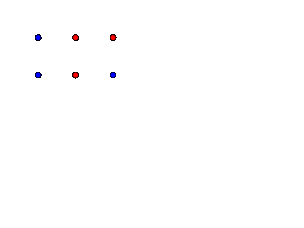

#Python Particle Simulator

This was a quick project to introduce a friend to the idea of object oriented programming using classes in python.

It ended up working quite well, taking forces due to charge and mass into account, simulating the movement of particles in a simplistic fashion.

However, it should be noted that collisions are currently not calculated, meaning that the particles can pass inside one another with a distance vector approaching zero, causing large velocities post collision.

###Saving Frames
Frames can be saved to postscript files, which can then be converted to gif using a command line utility such as [http://www.imagemagick.org](http://www.imagemagick.org)'s convert, with a command such as `convert -dispose background -delay 8 frame_*.ps anim.gif`.

###Example
The example below shows six particles arranged in a grid with equal mass and charge magnitude.

